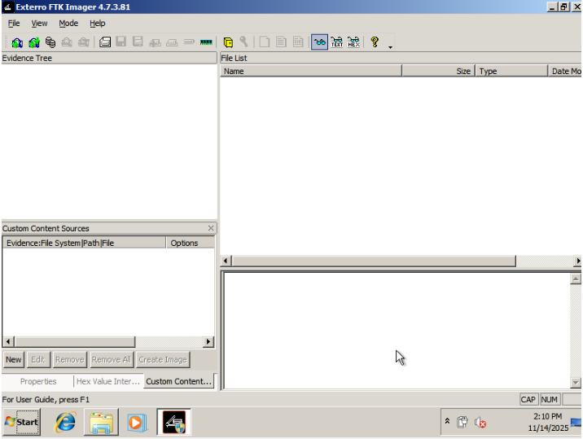
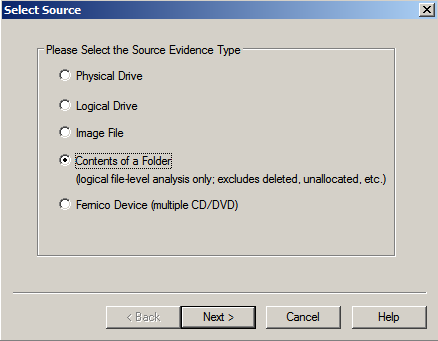
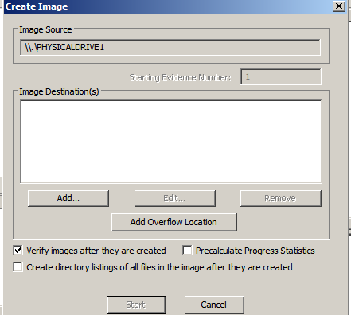
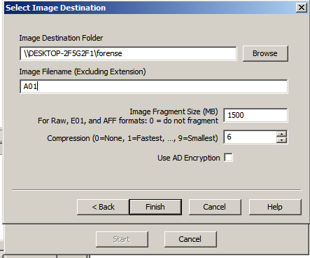
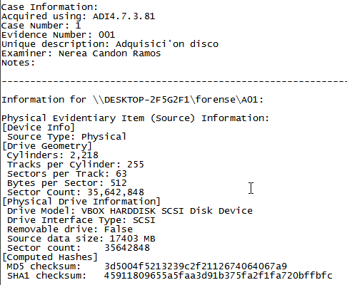
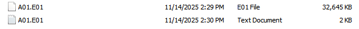
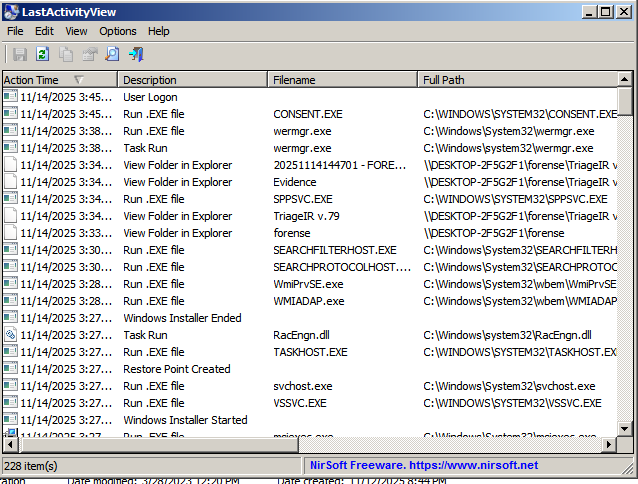
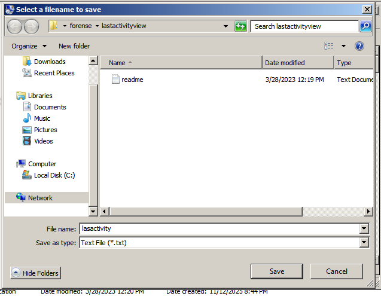
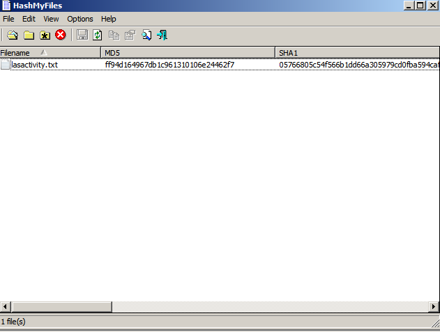
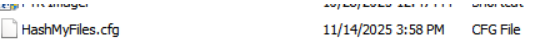

# Informe de Adquisición de Evidencias Digitales
## Proyecto 2: Incident Investigation

---

## Introducción

El presente informe documenta la simulación del Proyecto 2: Incident Investigation, en la que el equipo de Respuesta a Incidentes de Seguridad Informática (CSIRT) llevó a cabo una investigación forense tras la detección de una intrusión en una máquina del departamento de IT. Este ejercicio tiene como objetivo aplicar los principios del análisis forense digital y la respuesta ante incidentes (DFIR) para preservar evidencias, mantener la cadena de custodia y analizar los vestigios del ataque.

A través de la adquisición y el estudio metódico de los datos, se busca identificar las causas, el alcance del compromiso y las posibles vulnerabilidades explotadas, fortaleciendo así las capacidades técnicas y operativas del equipo frente a incidentes reales.

Asimismo, esta práctica permite comprobar la eficacia de los procedimientos internos de la organización en situaciones de ciber crisis simuladas. Gracias a la aplicación de metodologías forenses estandarizadas y al uso de herramientas especializadas, el equipo puede garantizar la integridad de las evidencias, mejorar su tiempo de respuesta y reforzar las estrategias de detección y contención de amenazas dentro del entorno corporativo.

---

## Procedimiento de Adquisición

El informe detalla el procedimiento de actuación que se empleó para la obtención de las evidencias digitales, el cual fue una metodología propia basada en estándares internacionales de respuesta a incidentes. A continuación se enumeran los pasos seguidos conforme a la metodología aplicada.

### Preservación de la Escena

Como es una práctica simulada, no se ha hecho nada para conservar la escena.

 Si se implementara en un caso real, siguiendo la metodología utilizada, se llevaría a cabo una delimitación de la zona para marcar un perímetro alrededor del lugar de los hechos con cintas de seguridad.  A continuación, se implementaría un control de acceso para que solo exista una entrada y una salida y así poder controlar el flujo de personas.  Finalmente, se requeriría el empleo de protección frente a la contaminación, como cubrebocas, guantes y similares.


### Identificación de Dispositivos

A continuación se describe la identificación y documentación inicial del dispositivo hallado durante la fase de recolección de evidencias:

Durante la inspección visual del área, se localizó una computadora de escritorio que fue seleccionada por ser relevante para la investigación. Las características técnicas del equipo son las siguientes:

| Característica | Descripción |
|---|---|
| **Sistema Operativo** | Windows Vista (64-bit) |
| **Identificador Interno** | FORENSIC_10 |
| **Memoria RAM** | 1024 MB |
| **Disco Duro Principal** | 32 GB (archivo FORENSIC_10_disk0.vdi) |
| **Estado al Momento de la Inspección** | Encendido, pantalla iluminada, sesión de usuario cerrada |

La documentación se complementó tomando nota de sus principales características técnicas, conexiones de red y periféricos conectados, tal como exige la metodología forense para asegurar la integridad y trazabilidad de la evidencia digital.


---

## Procedimiento Técnico de la Adquisición

Primero se procede a extraer la información de la memoria RAM, ya que es el componente del sistema más propenso a perder datos rápidamente y puede albergar información valiosa en ese instante. Tras esta extracción, el siguiente paso consiste en generar una imagen forense del disco duro, asegurando que se obtiene una copia fiel y completa del contenido almacenado para posteriores análisis.

### Adquisición de Memoria RAM

#### Extracción Remota con RamCapture

Para adquirir el contenido de la memoria RAM, se utilizó **RamCapture64**, herramienta que permite el volcado remoto de memoria sin alterar el entorno original. El comando empleado fue:

```bash
.\RamCapture64.exe --remote \\192.168.1.144 --output C:\Users\NEREA\Documents\forense\RAM_FORENSIC_10.raw
```

Este enfoque facilitó la preservación íntegra de la evidencia volátil de manera rápida, automatizada y sin necesidad de operar físicamente ni instalar herramientas dentro de la máquina comprometida.

#### Verificación de Integridad con FTK Imager

Con el objetivo de garantizar la integridad y autenticidad de la evidencia capturada, se procedió a verificar y calcular los valores hash criptográficos del archivo de volcado de RAM mediante **FTK Imager**. Este proceso es fundamental en la cadena de custodia digital, ya que cualquier modificación posterior al archivo generaría hashes diferentes, permitiendo detectar alteraciones no autorizadas.

Se cargó la imagen en FTK Imager y se ejecutó la función "Verify Drive/Image", que realizó un análisis criptográfico completo del archivo. Los resultados fueron los siguientes:

| Parámetro | Valor |
|---|---|
| **Hash MD5** | 9666ac032842bb0e423a6cfd108e74d1 |
| **Hash SHA1** | 53b928e6521e28171d390aa2ab7e9449c12cacb9 |
| **Estado de Bloques** | No bad blocks found in image |
| **Resultado de Verificación** | Match (coincidencia perfecta) |

Estos hashes actúan como una huella digital única e inmutable de la evidencia, certificando que el archivo no ha sufrido ninguna alteración desde su creación. Los hashes calculados se almacenaron como referencia para futuras verificaciones y auditorías.

#### Exportación a Formato Raw

Posteriormente, se exportó la imagen forense en formato Raw (dd) desde FTK Imager para obtener el archivo `memdump.mem`, que representa un volcado binario puro de la memoria RAM completamente compatible con herramientas de análisis avanzado como **Volatility**, permitiendo así proceder con la fase de análisis forense detallado de procesos, conexiones de red y otros artefactos de interés.


---

### Adquisición del Disco Duro con FTK Imager

Después de capturar la información más volátil, se procedió con la adquisición forense del disco duro de la máquina comprometida mediante **FTK Imager** para crear una imagen física (bit a bit) del disco.

#### Procedimiento Paso a Paso

**Paso 1: Ejecución como Administrador**

Es esencial iniciar FTK Imager con privilegios de administrador para evitar problemas de permisos durante la adquisición.

Para llevar a cabo todas las pruebas fue necesario compartir carpeta para poder utilizar todos los programas forenses necesarios.



**Paso 2: Creación de Imagen de Disco**

Se seleccionó la opción "Create Disk Image" para iniciar el proceso.


**Paso 3: Selección del Tipo de Adquisición**

Se eligió "Physical Drive" para realizar una adquisición completa del disco físico y se presionó "Next".



**Paso 4: Selección del Disco a Clonar**

Se seleccionó el disco de la máquina comprometida. Aunque por defecto se muestra el primer disco disponible, es importante verificar que sea el disco correcto antes de continuar.


**Paso 5: Definición de Ubicación para la Imagen**

Se configuró la ubicación donde se almacenaría la imagen forense. Se presionó "ADD" para establecer el destino de la adquisición.



**Paso 6: Formato de Imagen**

Se seleccionó el formato **E01** para la imagen, que permite almacenar metadatos y cálculos hash junto con la imagen.


**Paso 7: Relleno de Datos**

Se introdujeron los datos relevantes para la adquisición, incluyendo detalles del caso y del analista forense, para asegurar una documentación adecuada.


**Paso 8: Nombre y Finalización de la Configuración**

Se especificó el nombre del archivo de la imagen (en este caso, "A01") y se presionó "Finish" para completar la configuración.



**Paso 9: Inicio de la Adquisición**

Se inició la adquisición al pulsar "Start".


**Paso 10: Monitoreo del Progreso**

Se monitoreó el progreso de la adquisición hasta su finalización.


**Paso 11: Verificación de la Adquisición**

Al finalizar, FTK Imager mostró los hashes de verificación generados (MD5 y SHA-1), que servirán para confirmar la integridad de la imagen adquirida en futuras verificaciones.





---

### Toma de Triaje con Incident Response Triage

#### Configuración Inicial

Se inició la recopilación de información del sistema mediante **Incident Response Triage**, herramienta especializada en la captura rápida de artefactos del sistema.

#### Selección de Opciones de Captura

En la interfaz principal de Incident Response Triage, se seleccionaron las siguientes opciones para capturar información crítica del sistema:

- Información del sistema
- Procesos en ejecución
- Servicios en ejecución
- Handles
- Tareas programadas
- Información del nombre de host
- Información de AutoRun (importante para detectar posibles mecanismos de persistencia)
- Configuración de cuentas de usuario

Se eligieron todas las opciones de captura disponibles para asegurar que la recopilación de datos se realizara de forma completa en una única ejecución del triaje. Esto posibilita eludir la obligación de llevar a cabo nuevamente el procedimiento si se necesita información adicional en el futuro, lo que hace más eficiente y rápido el tiempo de respuesta ante incidentes.

#### Ejecución de la Herramienta y Progreso de Captura

Con las opciones configuradas, se presionó el botón "Run" para iniciar el triaje. Este proceso puede demorar dependiendo de la cantidad de datos a recopilar y de la velocidad del sistema.


---

### Fichero de Logs del Sistema

Para adquirir el fichero de logs del sistema, se utilizó **LastActivityView**.








Se procedió a la adquisición, la cual fue guardada en el archivo correspondiente. Posteriormente se calcularon los hashes del archivo mediante la herramienta **HashMyFiles**, para asegurar la validez del archivo a lo largo del procedimiento.






---

## Recolección de Dispositivos Físicos

Como se trata de una práctica simulada, se prescindió de una parte del procedimiento de recolección de dispositivos físicos.

Si se aplicara a un caso real, según la metodología utilizada, se llevaría a cabo una meticulosa recolección de dispositivos. Para ello se emplearían:

- **Guantes antiestáticos**: Para impedir que los dispositivos se dañen o contaminen
- **Desconexión segura**: Desconectar los aparatos de manera segura, cumpliendo con los procedimientos pertinentes para cada clase de dispositivo

Posteriormente se levantó el acta de adquisición de la evidencia digital y la cadena de custodia.

---

## Cadena de Custodia

### Acta de Adquisición Forense

| Campo | Información |
|---|---|
| **Fecha y Hora** | 14 de noviembre de 2025, 16:06 |
| **Lugar** | Oficina central de la empresa en Cádiz |
| **Perito Forense** | Nerea Candón Ramos |
| **Solicitante** | Departamento de Seguridad Informática |
| **Descripción del Dispositivo** | Ordenador de sobremesa |
| **Marca y Modelo** | HP ProDesk 600 G2 |
| **Capacidad** | 32 GB (disco duro), 1 GB (RAM) |
| **Estado Físico** | En buen estado |
| **Método de Adquisición** | Clonado bit a bit (disco duro), Volcado de memoria (RAM) |
| **Herramientas Utilizadas** | RamCapture, FTK Imager, IR Triage, LastActivityView, HashMyFiles |
| **Configuración** | Formato de imagen E01 para disco, archivo .mem para RAM |
| **Observaciones** | El proceso de adquisición se completó con éxito |

**Firmas:**
- **Perito Forense:** Nerea Candón Ramos
- **Testigo:** Nerea Candón Ramos
- **Responsable:** Nerea Candón Ramos

---

## Descripción de la Evidencia

### 1. Memoria RAM

| Característica | Detalle |
|---|---|
| **Tipo de Evidencia** | Volcado de Memoria |
| **Tamaño** | 18,4 GB (aprox.) |
| **Características Relevantes** | Contiene información volátil del sistema en ejecución, incluyendo procesos activos, fragmentos de claves, datos temporales y posibles indicadores de compromiso presentes en el momento de la adquisición |
| **Hash MD5** | 9666ac032842bb0e423a6cfd108e74d1 |
| **Hash SHA-1** | 53b928e6521e28171d390aa2ab7e9449c12cacb9 |
| **Algoritmo Utilizado** | MD5, SHA-1 |

### 2. Disco Duro

| Característica | Detalle |
|---|---|
| **Tipo de Evidencia** | Imagen Forense de Disco Físico |
| **Tamaño** | 17,4 GB (aprox.) |
| **Características Relevantes** | Contiene la estructura completa del disco físico, incluyendo tabla de particiones, sectores de arranque, sistema de archivos y todos los datos almacenados en el momento de la adquisición. Puede incluir archivos borrados, artefactos persistentes y metadatos útiles para reconstruir actividad previa del sistema |
| **Hash MD5** | 3d5004f5213239c2f2112674064067a9 |
| **Hash SHA-1** | 45911809655a5faa3d91b375fa2f1fa720bffbfc |
| **Algoritmo Utilizado** | MD5, SHA-1 |

---

## Almacenamiento de la Evidencia

### Método de Almacenamiento

Las evidencias se almacenan en una carpeta externa compartida con las siguientes características:

- **Ubicación Inicial:** Sala segura en la oficina central, controlada mediante sistema de acceso con registro biométrico
- **Medidas de Seguridad:** Las copias de seguridad se mantienen en una unidad separada dentro de una caja fuerte resistente al fuego

---

## Metodología Aplicada

Se ha aplicado la metodología siguiendo las normativas de referencia internacionales:

- **NIST** (National Institute of Standards and Technology)
- **UNE 71506** (Norma Española de análisis forense)
- **RFC 3227** (Guidelines for Evidence Collection and Archiving)

Estas normativas aseguran que el proceso de adquisición y preservación de las evidencias se realice conforme a los estándares establecidos en la investigación forense digital.

### Próximas Fases

El siguiente paso consiste en realizar un análisis detallado de las evidencias obtenidas, para posteriormente generar un informe forense completo y documentado, que incluya los hallazgos, la correlación de los datos y las conclusiones derivadas del caso.

---

**Documento Preparado por:** Nerea Candón Ramos  
**Fecha:** 14 de noviembre de 2025  
**Clasificación:** Investigación Forense Digital