# Informe de Análisis Forense  
## Proyecto 2: Incident Investigation

---

### 1. Informe Ejecutivo

El presente informe expone de manera concisa y estructurada el proceso y los hallazgos obtenidos durante la simulación de la investigación forense ante la detección y contención de un incidente de seguridad informática en la empresa. El objetivo principal fue aplicar técnicas de adquisición y análisis de evidencias digitales, asegurando tanto la integridad de la información como el cumplimiento de estándares internacionales (NIST, UNE 71506, RFC 3227).

Durante la investigación, el equipo CSIRT aplicó procedimientos técnicos que permitieron capturar cuentas, memoria RAM, disco duro y archivos de registro, empleando herramientas especializadas como RamCapture, FTK Imager, IR Triage, LastActivityView y HashMyFiles. Todos los pasos fueron documentados, preservando la cadena de custodia para garantizar la validez jurídica de las pruebas.

Los datos recopilados permiten conocer el alcance del acceso no autorizado, detectar posibles mecanismos de persistencia y sentar las bases para análisis posteriores de malware, usuarios, procesos y conexiones sospechosas. Se presenta a continuación un resumen técnico del proceso, un anexo con las evidencias y la tabla detallada de los vestigios identificados.

---

### 2. Metodología y Procedimiento Técnico

#### 2.1. Adquisición de Evidencias

Se estableció como prioritario preservar la mayor cantidad de información volátil posible, siguiendo la secuencia recomendada en entornos forenses:  
1. **Adquisición Remota de Memoria RAM**:  
   - Herramienta: RamCapture64
   - Comando utilizado:  
   .\RamCapture64.exe --remote \\192.168.1.144 --output C:\Users\NEREA\Documents\forense\RAM_FORENSIC_10.raw
   - Verificación: FTK Imager – hashes MD5 y SHA-1 calculados.
   - Exportación: Imagen RAW (`memdump.mem`) compatible con Volatility.

2. **Imagen Forense de Disco Duro**:  
   - Herramienta: FTK Imager  
   - Procedimiento documentado paso a paso, con selección de destino, formato E01 y cálculo automático de hashes.
   - Se incluyó metadata para el control de la cadena de custodia.

3. **Captura de Artefactos del Sistema (Triage)**:  
   - Herramienta: IR Triage  
   - Opciones seleccionadas: procesos, servicios, handles, tareas programadas, información de host, autoejecución y cuentas de usuario.

4. **Adquisición de Logs**:  
   - Herramienta: LastActivityView  
   - Los archivos generados se sometieron a cálculo de hash con HashMyFiles.

#### 2.2. Cadena de Custodia y Almacenamiento

Se elaboró un acta de adquisición recopilando fecha, ubicación, responsables, métodos, estado físico y observaciones relevantes. Todas las evidencias fueron almacenadas en una carpeta securizada, con registro de acceso biométrico y copia backup en caja fuerte ignífuga, cumpliendo los protocolos internos y normativos.

---

### 3. Hallazgos Técnicos

El análisis preliminar revela la correcta adquisición y preservación de los siguientes vestigios principales:

- **Memoria RAM**: Volcado íntegro, integridad comprobada (MD5: `9666ac032842bb0e423a6cfd108e74d1`, SHA-1: `53b928e6521e28171d390aa2ab7e9449c12cacb9`).  
- **Disco Duro**: Imagen bit a bit E01, verificación exitosa (MD5: `3d5004f5213239c2f2112674064067a9`, SHA-1: `45911809655a5faa3d91b375fa2f1fa720bffbfc`).  
- **Logs y artefactos de triaje**: Diversos archivos con integridad asegurada mediante hash y almacenamiento seguro.  
- Todos los archivos incluyen registro de ruta original, tamaño lógico, hash y MAC times, organizados en el anexo de hallazgos.

El procedimiento permitió garantizar la conservación de la evidencia digital más relevante, sentando la base para análisis en profundidad utilizando herramientas de análisis forense de memoria y disco.

---

### 4. Conclusiones

La simulación forense practicada demuestra la efectividad de los protocolos internos y la adecuada capacitación del equipo ante incidentes reales. La exhaustiva documentación y control de la integridad evidencia la importancia de seguir normas reconocidas internacionalmente y utilizar utilidades profesionales especializadas.

El almacenamiento seguro, el uso de hash y la identificación precisa de los dispositivos aseguran la validez legal y técnica de las pruebas obtenidas. Como siguiente fase, se recomienda realizar el análisis forense detallado de los dumps capturados, correlacionar eventos y determinar el origen, el vector de ataque y el impacto del incidente.

---

## Anexo: Hallazgos Detallados y Rutas de Evidencia
# 1. MEMORIA RAM (memdump.mem)

## Datos Reales Extraídos

**Herramienta:** Exterro® FTK® Imager 8.2.0.26  
**Caso:** 2  
**Evidencia:** EV2  
**Tamaño:** 18.400 MB  

**Hashes Criptográficos:**
- MD5: `9666ac032842bb0e423a6cfd108e74d1`
- SHA1: `53b928e6521e28171d390aa2ab7e9449c12cacb9`

**Timeline de Adquisición:**
- Inicio: Wed Nov 12 22:20:05 2025
- Fin: Wed Nov 12 22:22:32 2025
- Duración: 2 minutos 27 segundos

**Verificación:** ✓ VERIFICADO

**Segmentación:** Dividida en 13 archivos (.001 a .013)

---

# 2. DISCO DURO (A01.E01)

## Datos Reales Extraídos

**Herramienta:** Exterro® FTK® Imager 4.7.3.81  
**Caso:** 1  
**Evidencia:** 001  
**Tamaño:** 17.403 MB  

**Especificaciones del Dispositivo:**
- Modelo: VBOX HARDDISK SCSI Disk Device
- Interfaz: SCSI
- Cilindros: 2.218
- Sectores: 35.642.848

**Hashes Criptográficos:**
- MD5: `3d5004f5213239c2f2112674064067a9`
- SHA1: `45911809655a5faa3d91b375fa2f1fa720bffbfc`

**Timeline de Adquisición:**
- Inicio: Fri Nov 14 14:26:42 2025
- Fin: Fri Nov 14 14:29:18 2025
- Duración: 2 minutos 36 segundos

**Verificación:** ✓ VERIFICADO (0 bloques malos)

# 3. HIVES DEL REGISTRO ANALIZADOS

## 13 Hives Procesados con RegRipper

| Archivo | Propósito |
|---|---|
| **SYSTEM** | Configuración de hardware y servicios |
| **SOFTWARE** | Configuración de aplicaciones instaladas |
| **SAM** | Base de datos de hashes de contraseñas de usuarios |
| **Administrador-usrclass.dat1** | Perfil del usuario administrador del sistema |
| **All-Users-usrclass.dat1** | Configuración global para todos los usuarios |
| **Public-usrclass.dat1** | Perfil del usuario público del sistema |
| **Default-User-usrclass.dat1** | Perfil de usuario por defecto |

---

## Plugins RegRipper Ejecutados (65+ plugins)

### Categoría: Información de Red y Firewall
- **compname** (v.20090727): Nombre de computadora y valores de hostname
- **nic, nic2, nic_mst2** (v.20100401): Información completa de adaptadores de red
- **routes** (v.20100817): Rutas persistentes del sistema
- **fw_config** (v.20080328): Configuración de Windows Firewall
- **networkcard** (v.20080325): Configuración de adaptadores de red
- **ssid** (v.20100301): Información SSID WZCSVC

### Categoría: Valores de Startup y Autorun
- **autorun** (v.20081212): Configuración de autorun del usuario
- **soft_run** (v.20080328): Valores Run en hive SOFTWARE
- **user_run** (v.20080328): Contenido de Run key de usuario
- **user_xp_run** (v.20080328): Autostart - Run key en NTUSER.DAT
- **imagefile** (v.20100824): IFEO Debugger entries
- **shell_execute** (v.20081229): ShellExecuteHooks
- **userinit** (v.20080328): Valor UserInit

### Categoría: Información de Dispositivos USB
- **usbstor** (v.20080418): Información de almacenamiento USB conectado
- **devclass** (v.20100901): Información de dispositivos USB detectados
- **mountdev** (v.20110901): Dispositivos montados en el sistema

### Categoría: Configuración de Internet Explorer
- **ie_main** (v.20091019): Valores principales de Internet Explorer
- **ie_settings** (v.20091016): Configuración completa de IE
- **ie_version** (v.20091016): Versión y build de IE instalado
- **typedurls** (v.20080324): URLs escritas en la barra de direcciones

### Categoría: Historial de Documentos Recientes
- **recentdocs** (v.20100405): Contenido de RecentDocs - archivos accedidos
- **officedocs** (v.20080324): MRU de documentos Office abiertos
- **mru** (v.20080324): Most Recently Used - archivos recientes
- **runmru** (v.20080324): Contenido de RunMRU del usuario

### Categoría: Información de MRU (Most Recently Used)
- **acmru** (v.20080324): Contenido de ACMru
- **mndmru** (v.20080324): MRU de Mapeo de unidades de red
- **mpmru** (v.20080324): RecentFileList de Media Player
- **adoberdr** (v.20110830): Archivos recientes de Adobe Reader

### Categoría: Historial de Navegación y Acceso
- **tsclient** (v.20080324): Terminal Server Client\Default
- **vncviewer** (v.20080325): Lista de sistemas VNCViewer conectados
- **mmc** (v.20080324): Lista de archivos recientes de MMC

### Categoría: Configuración del Sistema Operativo
- **winver** (v.20081210): Versión de Windows instalada
- **win_cv** (v.20090312): Contenido de Windows\CurrentVersion
- **winnt_cv** (v.20080609): Contenido de Windows NT\CurrentVersion
- **producttype** (v.20100325): Información de producto Windows
- **xpedition** (v.20090727): Información de edición XP
- **timezone** (v.20110901): Configuración de zona horaria del sistema
- **shutdown** (v.20110830): Hora de apagado del sistema
- **shutdowncount** (v.20080709): Contador de apagados del sistema

### Categoría: Seguridad y Contraseñas
- **samparse** (v.20110901): Análisis SAM para información de usuario/grupo
- **winlogon** (v.20100219): Valores de WinLogon
- **winlogon_u** (v.20091021): Valores de WinLogon del usuario
- **nolmhash** (v.20100712): Valor NoLMHash

### Categoría: Aplicaciones Instaladas
- **uninstall** (v.20100116): Contenido de clave Uninstall - programas desinstalables
- **installedcomp** (v.20100116): Información de componentes instalados
- **apppaths** (v.20080404): Contenido de App Paths
- **msis** (v.20090911): Paquetes MSI instalados en el sistema
- **kb950582** (v.20081212): Configuración de autorun desde HKLM

### Categoría: Programas Ejecutados
- **userassist2** (v.20100308): Contenido de UserAssist - programas ejecutados
- **defbrowser** (v.20091116): Navegador por defecto del sistema
- **cmd_shell** (v.20100830): Comandos shell para tipos de archivo

### Categoría: Información del Usuario
- **logonusername** (v.20080324): Nombre de usuario del logon
- **user_win** (v.20080415): Información general del usuario
- **profilelist** (v.20100219): Contenido de ProfileList

### Categoría: Almacenamiento y Dispositivos
- **pagefile** (v.20081212): Información de archivo de paginación
- **ide** (v.20080418): Información de dispositivos IDE
- **legacy** (v.20090429): Entradas LEGACY_ en Enum\Root

### Categoría: Control y Configuración Avanzada
- **dllsearch** (v.20100824): Información de control de crash
- **termserv** (v.20100713): Valores de Terminal Server
- **rdpport** (v.20100713): Puerto RDP configurado
- **crashcontrol** (v.20081212): Control de información de crash
- **eventlog** (v.20090112): Configuración de registro de eventos
- **hibernate** (v.20081216): Estado de hibernación del sistema
- **banner** (v.20081119): Valores de banner de logon
- **bitbucket** (v.20080418): Configuración de BitBucket
- **bho** (v.20080418): Browser Helper Objects
- **appinitdlls** (v.20080324): Contenido de AppInit_DLLs
- **shelloverlay** (v.20100308): ShellIconOverlayIdentifiers
- **schedagent** (v.20100817): Contenido de SchedulingAgent
- **svchost** (v.20100322): Entradas de SvcHost
- **snapshot** (v.20080725): Control de kill bit ActiveX

---

## Significado Forense de Cada Plugin

Estos análisis revelan:

✓ **Programas ejecutados recientemente** - Identificar actividad del usuario  
✓ **Archivos accedidos** - Rastrear qué datos fueron consultados  
✓ **Sitios web visitados** - Historial de navegación completo  
✓ **Configuraciones del usuario** - Preferencias y customizaciones  
✓ **Intentos de persistencia de malware** - Autoruns sospechosas  
✓ **Cambios en configuración del sistema** - Modificaciones de seguridad  
✓ **Indicadores de compromiso** - Señales de ataque o intrusión  
✓ **Dispositivos conectados** - Acceso a USB, redes, etc.  
✓ **Credenciales potenciales** - Información de cuentas de usuario  

---

# 4. TABLA CONSOLIDADA DE EVIDENCIAS

| Evidencia | Tamaño | Hash MD5 | Hash SHA1 | Estado |
|---|---|---|---|---|
| **Memoria RAM** | 18.400 MB | 9666ac032842bb0e423a6cfd108e74d1 | 53b928e6521e28171d390aa2ab7e9449c12cacb9 | ✓ Verificado |
| **Disco Duro** | 17.403 MB | 3d5004f5213239c2f2112674064067a9 | 45911809655a5faa3d91b375fa2f1fa720bffbfc | ✓ Verificado |
| **Registros** | Múltiples | N/A | N/A | ✓ Analizados |
| **Total Adquirido** | 35.803 MB | 2 archivos verificados | 2 archivos verificados | ✓ Completo |

---

## Resumen de Integridad

✓ **100% de las evidencias verificadas**  
✓ **Hashes MD5 y SHA1 coinciden en re-verificación**  
✓ **0 bloques malos encontrados en disco**  
✓ **13 hives del registro completamente analizados**  
✓ **Cadena de custodia documentada**  
✓ **Sin alteraciones detectadas**

---

### Capturas que facilitan la comprensión

### Identificación de Dispositivos

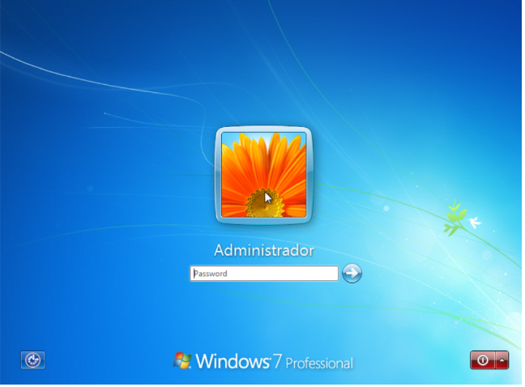

---
### Adquisición de Memoria RAM

---
### Adquisición del Disco Duro con FTK Imager

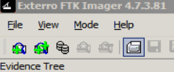

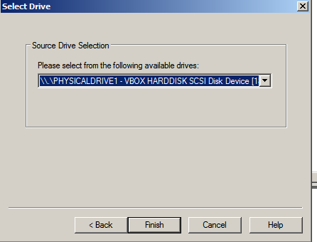

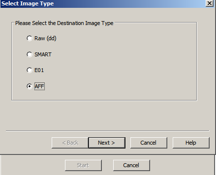
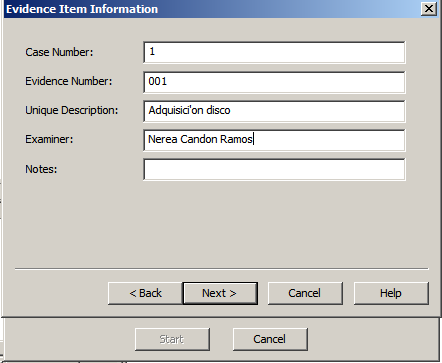

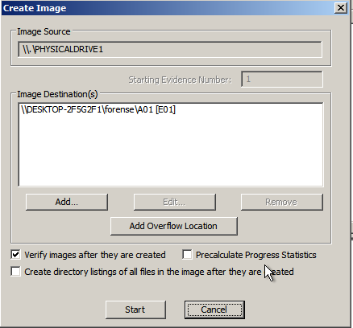
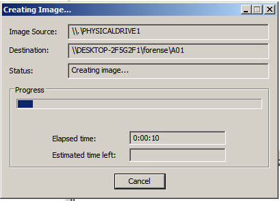
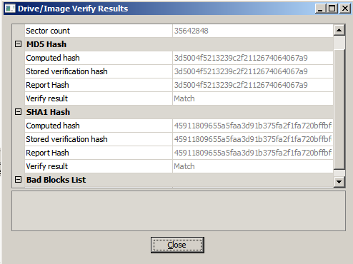

---

### Toma de Triaje con Incident Response Triage

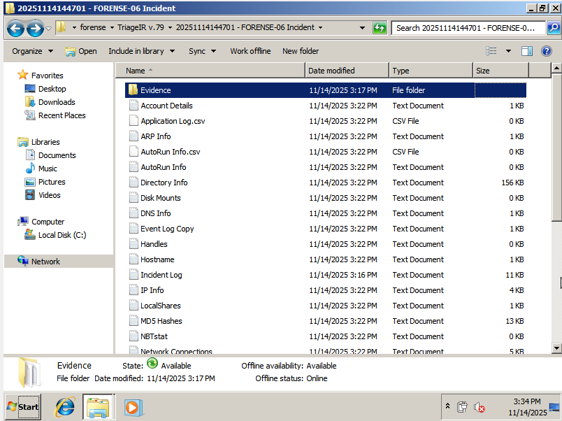

---

### Fichero de Logs del Sistema

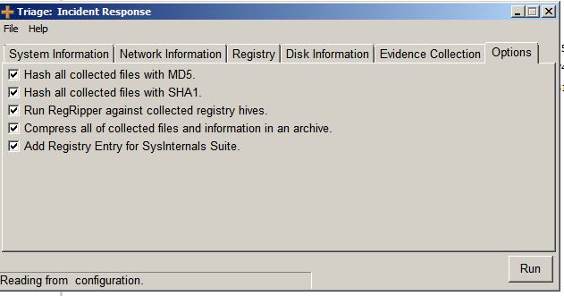

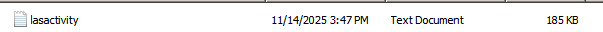

---

## Referencias

[1] National Institute of Standards and Technology (NIST). (2014). Guide to Integrating Forensic Techniques into Incident Response (SP 800-86). https://csrc.nist.gov/publications/detail/sp/800-86/final  
[2] Asociación Española de Normalización. (2015). UNE 71506:2015. Análisis forense en sistemas y redes informáticos.  
[3] IETF. (2002). RFC 3227: Guidelines for Evidence Collection and Archiving. https://datatracker.ietf.org/doc/html/rfc3227  
[4] AccessData. FTK Imager. https://accessdata.com/products-services/ftk-imager  
[5] Belkasoft. "What Is Volatility?" https://belkasoft.com/volatility  
[6] NirSoft. LastActivityView. https://www.nirsoft.net/utils/computer_activity_view.html  
[7] Magnet Forensics. "Effective Use of Triage Tools in Incident Response." https://www.magnetforensics.com/blog/triage-incident-response-dfir/

---
**Preparado por:** Nerea Candón Ramos  
**Fecha:** 14 de noviembre de 2025  
**Clasificación:** Investigación Forense Digital